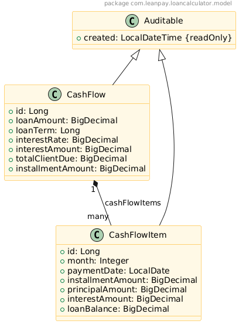

# Loan Calculator Application

This is a simple Spring Boot application that calculates loan repayment plans based on given parameters.

## Features

- Generate amortization plan based on loan amount, term, and interest rate
- Retrieve loan details and repayment schedule via REST API
- Uses JPA entities `CashFlow` and `CashFlowItem`
- Utilizes `CashFlowCalculatorUtil` for financial calculations

## Technologies

- Java 21
- Spring Boot
- Spring Data JPA
- PostgreSQL
- PlantUML for diagrams

## UML Class Diagram



## UML Sequence Diagram


## Running the Application

1. Clone the repository:

    ```bash
    git clone https://github.com/dexa995/loan-calculator
    ```

2. Run the application:

    Prerequisites: Docker

    2.1.Navigate to the docker folder
    ```bash
    cd docker
    ```
    2.2.Start the application using command:
    ```bash
    docker-compose up --build -d
    ```
    2.3.After successfully starting the application, you can find Swagger endpoints on:
    ```bash
    http://localhost:8080/swagger-ui/index.html
    ```

3. Available API endpoints:

- `POST /cash-flows` - create and generate loan repayment plan
- `GET /cash-flows/{id}` - get loan details and repayment plan
