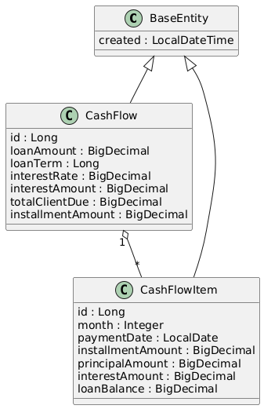
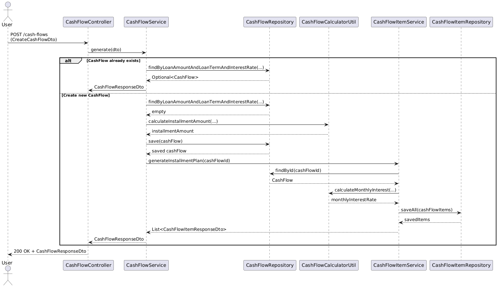

# 💰 Loan Calculator Application

This is a simple Spring Boot application that calculates loan repayment plans based on given parameters.

---

## ✨ Features

- 📈 Generate amortization plans based on loan amount, term, and interest rate
- 🔍 Retrieve loan details and repayment schedules via REST API
- 🧩 Uses JPA entities: `CashFlow` and `CashFlowItem`
- 🧮 Utilizes `CashFlowCalculatorUtil` for financial calculations

---

## 🛠 Technologies Used

- Java 21
- Spring Boot 3
- Spring Data JPA
- PostgreSQL
- PlantUML (for class and sequence diagrams)

---

## 🧭 UML Diagrams

### Class Diagram


### Sequence Diagram


---

## 🚀 Getting Started

### 1. Clone the Repository

```bash
git clone https://github.com/dexa995/loan-calculator
cd loan-calculator
```

### 2. Run with Docker Compose

**Prerequisite:** [Docker](https://www.docker.com/) installed.

#### Step 2.1: Navigate to the Docker folder

```bash
cd docker
```

#### Step 2.2: Start the application

```bash
docker-compose up --build -d
```

This will:
- Build the Spring Boot application
- Start a PostgreSQL container
- Launch the application at `http://localhost:8080`

---

## 🔌 API Endpoints

| Method | Endpoint              | Description                                     |
|--------|-----------------------|-------------------------------------------------|
| POST   | `/cash-flows`         | Create a new loan and generate a repayment plan |
| GET    | `/cash-flows/{id}`    | Retrieve loan details and amortization plan     |

---

## 🧹 Stopping the App

To stop and remove containers:

```bash
docker-compose down
```

To also remove the associated volumes:

```bash
docker-compose down -v
```